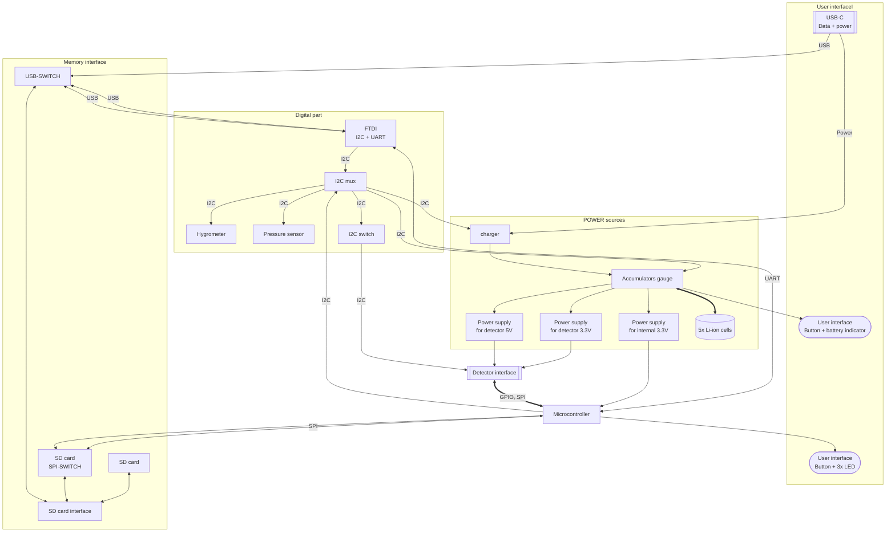

# BATDATSOCKET01B - Li-ion power and Data Storage Module socket interface

The BATDATSOCKET01 is a complementary module to the battery and data module [BATDATUNIT01](https://github.com/mlab-modules/BATDATUNIT01). It is a reliable power source for extended durations, making it an integral component in a wide array of detectors or measuring systems.

## Applications

The BATDATUNIT01 is designed for versatility:

- As a **power module for semiconductor particle detectors** like the [AIRDOS04](https://github.com/UniversalScientificTechnologies/AIRDOS04), it ensures uninterrupted data acquisition in environmental monitoring.
- It can be integrated into **remote sensing stations**, where it provides consistent power and data logging capabilities for long-term ecological studies.
- In **automated weather stations**, the module's resilience and sensor suite offers valuable insights into meteorological conditions.
- The module can be deployed in **mobile robotics** for energy supply and environmental data collection, aiding navigation and decision-making processes.
- It is also ideal for **educational purposes**, as a hands-on tool to teach about energy management, data acquisition, and sensor integration.

For more detailed information on interfacing and protocols, please refer to the [BATDATUNIT01](https://github.com/mlab-modules/BATDATUNIT01) documentation.

## Design

Designed for convenience, the module allows for fast detachment from the measuring part without tools, streamlining the replacement process. Data can be downloaded during battery charging thanks to onboard memory.

### Internal structure

## Connectivity

A durable connector brings together data and detection elements with impressive mechanical resilience. It hosts UART, I2C, SPI buses, and extra GPIO signals, providing extensive interfacing options with various systems.

